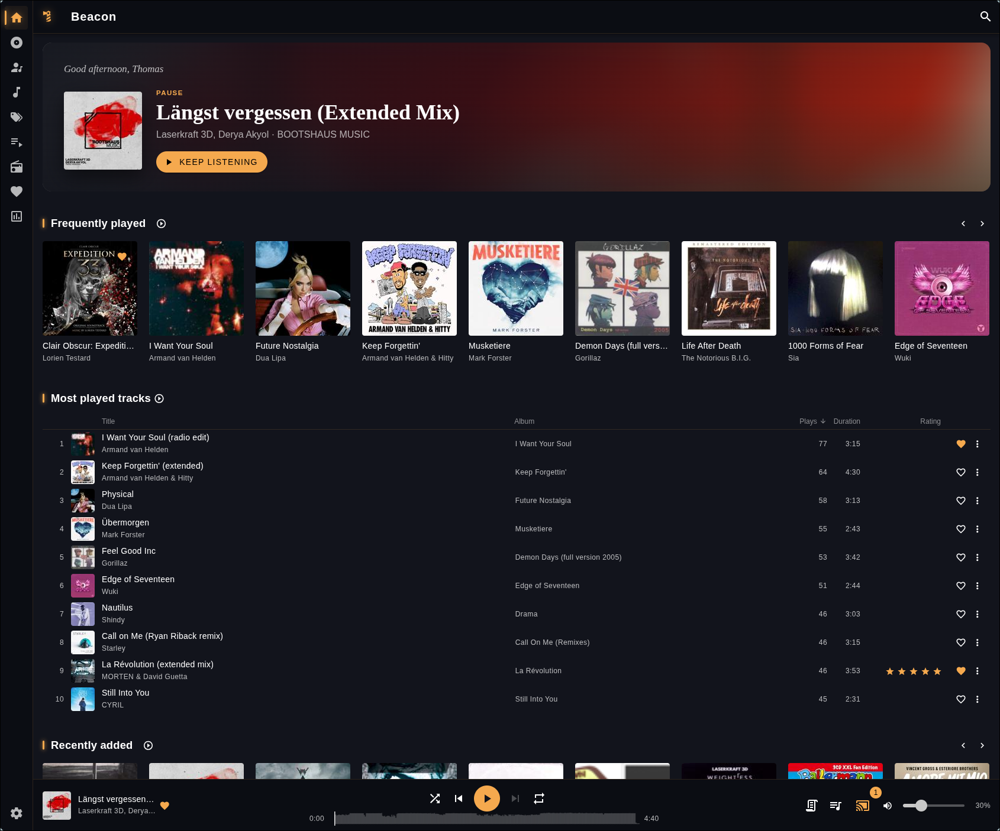
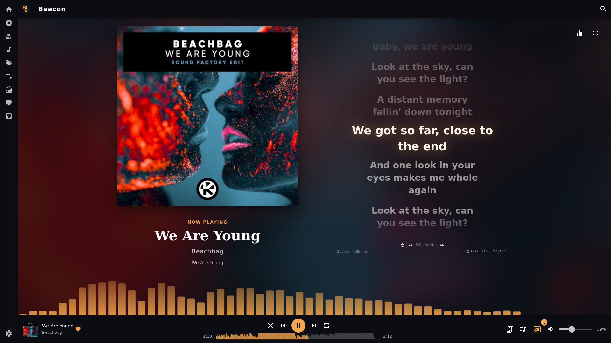
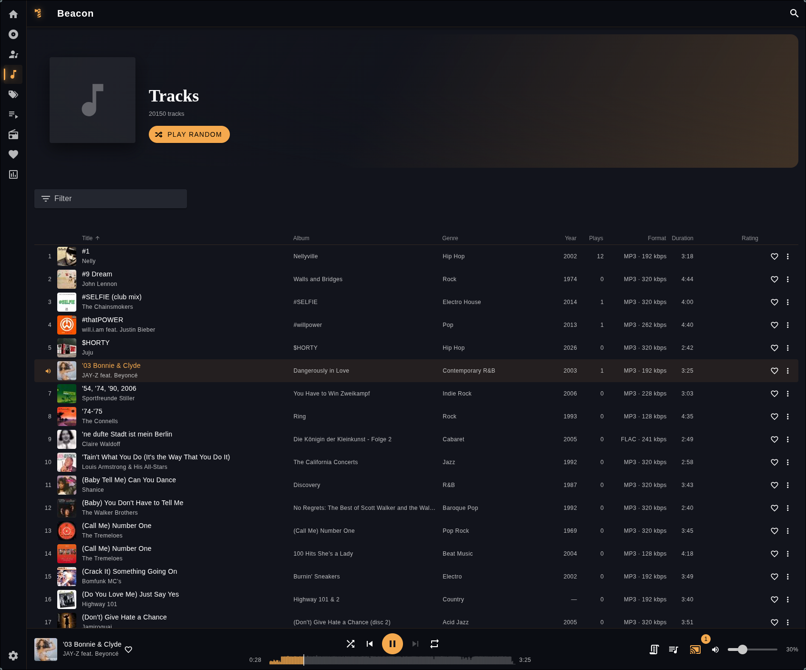
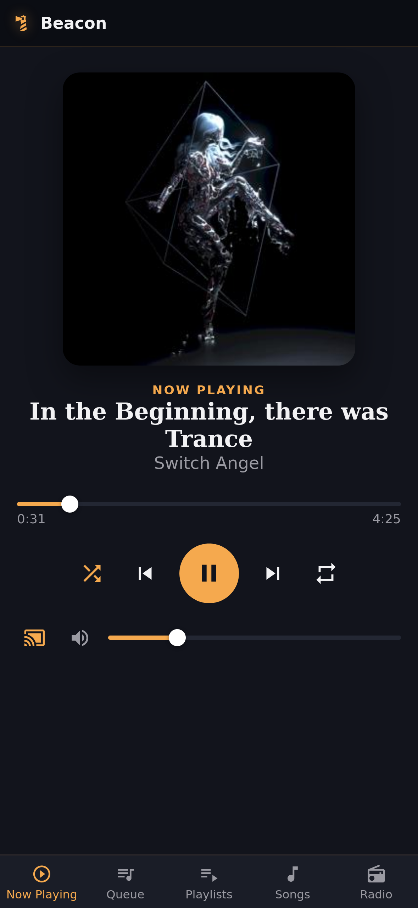
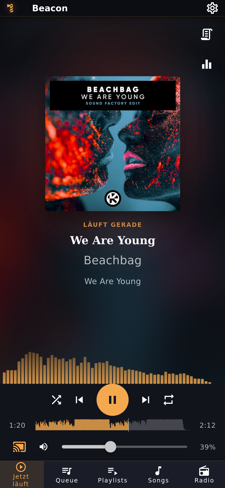

<p align="center">
  
</p>

# Beacon

> A self-hosted music client for Navidrome, Subsonic / OpenSubsonic, and (experimentally) Jellyfin and Plex - with built-in casting to Sonos, AirPlay, Chromecast, and DLNA/UPnP devices.

<p align="center"><sub>Yes, that's just <code>mdi-lighthouse-on</code> tinted amber. I write backend code for a living, not logos. This is as good as the branding gets.</sub></p>

<p align="center">
  <a href="https://github.com/mihaitom/beacon/actions/workflows/test-python.yml">
    
  </a>
  <a href="https://github.com/mihaitom/beacon/commits/development">
    
  </a>
</p>

> **Development note:** This project is developed with AI assistance. Please expect rough edges and report issues if you encounter them.

---

## Screenshots

<p align="center">
  
  <br><em>Home</em>
</p>
<p align="center">
  
  <br><em>Now Playing</em>
</p>
<p align="center">
  
  <br><em>Library</em>
</p>
<p align="center">
  
  
  <br><em>Remote Control (Electron) and the responsive mobile web UI (Docker/web)</em>
</p>

---

## Why Beacon?

Beacon grew out of [Feishin Connect](https://github.com/mihaitom/feishin-connect), my own fork of [jeffvli/feishin](https://github.com/jeffvli/feishin) - a general-purpose Electron/React music player - that added a Python casting backend (`connect/`) as a feature bolted onto it (a button in the player bar). That backend, a real self-contained FastAPI service discovering cast devices, streaming to them, and tracking playback state on its own, turned out to be the part worth building on. But building on top of it meant building _around_ Feishin: every change had to fit inside an app and a codebase designed for a different purpose, and that got harder, not easier, the more `connect` grew into its own thing.

Beacon is `connect` as the actual foundation instead of an add-on - a frontend built specifically for it, not retrofitted onto one. Every playback action (local _and_ cast) goes through the same session, the same clock, the same auth token, instead of two loosely-connected halves of an app. The frontend is a from-scratch Vue 3 rebuild rather than carrying along Feishin's inherited React codebase and its full general-purpose feature surface. What that's bought so far: multi-user sessions where independent logins on the same deployment get independent playback to independent devices at the same time, a lyrics/visualizer sync calibrated against each cast device's own real position rather than a fixed guess, a login/session model that treats Jellyfin and Plex as first-class server types instead of an afterthought, and a phone that can either pair up as a dedicated remote for the desktop app or simply _be_ the player itself on the web build.

---

## Features

- **Sign in with Navidrome, Subsonic/OpenSubsonic, or (experimentally, see below) Jellyfin or Plex**, and stay signed in across restarts. The server-URL field remembers previously used servers (deletable, one by one) so switching between them is one click.
- **Browse your library** - Albums, Artists, Tracks, Genres, Playlists, Favorites, and search, all with local filtering across the whole library.
- **A proper Home** - quick access to what you've been listening to, most played tracks, recently added albums, and real recommendations: a Discover shelf seeded from artists you actually play (via MusicBrainz + ListenBrainz), plus a "New to explore" shelf of similar artists not yet in your library, complete with photos and a link out. Toggleable in Settings.
- **A Stats page** - library and listening totals, top tracks/artists/albums/genres, format and decade breakdowns.
- **Local playback** - queue, shuffle, repeat, seek, volume, multiselect (bulk queue/playlist actions), starring and rating tracks, ReplayGain (track/album gain), synced/unsynced lyrics, a fullscreen Now Playing view, and a real-time frequency visualizer (local playback and casting alike).
- **Casting to Sonos, AirPlay, Chromecast, and DLNA devices** - including casting to several at once, taking over a device someone else is using (with a confirmation prompt), and per-device volume control. AirPlay 2 pairing is handled for devices that require it (HomePods, Apple TVs). Casting auto-advances through the queue server-side, so it keeps going even if the controlling window is asleep or a phone's screen is locked.
- **Multi-user** - different logins on the same deployment each get independent playback to independent devices at the same time.
- **Remote Control** - pair a phone to the desktop app over the LAN via QR code or PIN, no app install needed, and control local playback (Now Playing, Queue, Playlists, Tracks, Radio) from it. Electron only - see below.
- **A responsive mobile web UI** - open the Docker/web deployment directly on a phone's browser and it _is_ the player, no pairing needed.
- **Internet radio stations** - add, play, and manage your own, with favicon lookup.
- **Trigger a Navidrome library rescan** from Settings, with a completion notice.
- **Adjustable backend log level** (Trace/Debug/Info/Warning/Error) from Settings, in effect immediately, no restart needed - Debug covers Beacon's own code, Trace also turns on the third-party libraries underneath it (SoCo, pyatv, HTTP clients) for SOAP/HTTP-level detail. `LOG_LEVEL` is the env var fallback for a deployment that never comes up far enough to reach Settings.
- **Update notifications** - a dismissable/snoozable toast when a new release is out; auto-downloads in the background on Electron, links to the release on the web build.
- **German, English, Spanish, French, and Italian UI**, detected automatically and switchable anytime in Settings.

### Jellyfin and Plex support (experimental)

Jellyfin and Plex can both be selected as a server type at login. Neither has a Subsonic-compatible API of its own, so the `connect` backend translates Subsonic-shaped requests into real Jellyfin/Plex API calls on the fly (see `connect/media/jellyfin_bridge.py` and `connect/media/plex_bridge.py`) - the frontend doesn't know the difference. Features a given backend has no equivalent for (or that just aren't bridged yet) are hidden automatically rather than shown as dead-end controls. Both paths are newer and less exercised than the Navidrome/Subsonic one.

| Feature                                          | Navidrome / Subsonic | Jellyfin | Plex  |
| ------------------------------------------------- | :-------------------: | :------: | :--------: |
| Library browsing, playlists, casting              |           ✅           |    ✅    |   ✅      |
| Internet radio stations                           |           ✅           |    ✅    |   ✅      |
| Play history / Stats page                         |           ✅           |    ✅    |   ✅      |
| Favorites (heart icon)                            |           ✅           |    ✅    |   ❌      |
| Personal 1-5 star rating                          |           ✅           |    ❌    |   ✅      |
| Song/Artist Radio and Autoplay                    |           ✅           |    ✅    |   ❌      |
| Create playlists                                  |           ✅           |    ✅    |   ✅      |
| Trigger a library rescan from Settings            |           ✅           |    ❌    |   ❌      |

A couple of these are real gaps to close, not things Plex is actually incapable of - Plex does have its own sonic-similarity/"Play Similar" mechanism, it just hasn't been bridged into `getSimilarSongs2.view` yet (unlike Jellyfin's InstantMix, which has). Favorites is the one genuine dead end: Plex's core Media Server API has no separate boolean favorite at all - the heart-shaped "Love" seen in Plexamp/mobile is backed by Plex Pass cloud sync (a different API this bridge doesn't talk to), and personal ratings already cover the "mark this" use case for Plex instead.

### Remote Control (Electron) and the mobile web UI

Two different answers to "control Beacon from my phone", depending on how you run it:

- **Electron (desktop app):** Settings → Remote Control pairs a phone to _that specific, already-running_ desktop window over the LAN - scan a QR code or type in a short PIN, no app install on the phone. It relays commands to the same local playback the desktop window already has open (Now Playing, Queue, Playlists, Tracks, Radio), not to casting sessions, which already have their own independent per-device control. The pairing credential is a long random token separate from `CONNECT_TOKEN`, regenerated every time the feature is (re-)enabled, and the feature auto-disables if the desktop app goes away.
- **Docker/web:** there's no separate desktop window to pair against - the browser tab already is the player. Opening the deployment directly on a phone's browser switches to a responsive mobile layout automatically; nothing to enable.

---

## Docker (recommended)

> **`network_mode: host` is required.** The Connect backend discovers Sonos, AirPlay, Chromecast, and DLNA devices via mDNS/SSDP multicast, which only works when the container shares the host's network stack. Without it, no devices will be found. Host networking is Linux-only - on Mac or Windows, run the backend natively instead.

> [!CAUTION]
> **Not designed to be exposed to the open internet on its own.** This deployment expects an authentication layer in front of it (e.g. Authentik, Authelia, or a reverse proxy with basic auth) if it's reachable from outside your local network. Your media server's own login is not a substitute for that.

```yaml
services:
  beacon:
    container_name: beacon
    image: ghcr.io/mihaitom/beacon:latest
    restart: unless-stopped
    network_mode: host
    volumes:
      - ./data:/data
```

That's it - Beacon asks for your server URL, username, and password on first launch; nothing needs to be pre-configured. See the environment variables below for optional locking, LAN optimization, and SSO scenarios.

**Mount a volume at `/data`** to keep AirPlay 2 pairings, your log-level setting, the recommendations cache, and (for Jellyfin/Plex sessions) your internet radio stations across container recreations/updates.

### Environment variables

| Variable                 | Default              | Description                                                                                                                                                                                                                                                                                                                                                                                                                                                                                                                                                                                                                                                                                                                                                                                                                                                                                                                                |
| ------------------------ | -------------------- | ------------------------------------------------------------------------------------------------------------------------------------------------------------------------------------------------------------------------------------------------------------------------------------------------------------------------------------------------------------------------------------------------------------------------------------------------------------------------------------------------------------------------------------------------------------------------------------------------------------------------------------------------------------------------------------------------------------------------------------------------------------------------------------------------------------------------------------------------------------------------------------------------------------------------------------------ |
| `WEB_PORT`               | `7070`               | Port nginx (the Beacon web UI) listens on. Change if `7070` is already taken on the host.                                                                                                                                                                                                                                                                                                                                                                                                                                                                                                                                                                                                                                                                                                                                                                                                                                                  |
| `PORT`                   | `7071`               | Port the Connect API (Python backend) listens on. Change if `7071` is already in use - nginx still proxies `/api/` to whatever `PORT` is set to, no other change needed.                                                                                                                                                                                                                                                                                                                                                                                                                                                                                                                                                                                                                                                                                                                                                                   |
| `CONNECT_TOKEN`          | _(random per start)_ | Secret token protecting the Connect API. If unset, a random one is generated each start - nginx adds it to every internal request automatically, so the browser never handles it directly. Only set this explicitly if something needs to call the API directly, bypassing nginx, with a token that survives restarts.                                                                                                                                                                                                                                                                                                                                                                                                                                                                                                                                                                                                                     |
| `CONNECT_DATA_DIR`       | `/data` in Docker    | Directory persistent backend files are stored in - AirPlay 2 pairing credentials, the log-level setting, the recommendations cache, and (Jellyfin/Plex sessions only) internet radio stations. Docker already defaults this to `/data`; just mount a volume there.                                                                                                                                                                                                                                                                                                                                                                                                                                                                                                                                                                                                                                                                         |
| `NAVIDROME_INTERNAL_URL` | -                    | An alternate, more directly reachable address for Navidrome than whatever URL you log in with. **Navidrome/Subsonic only** - see `JELLYFIN_INTERNAL_URL` below for the Jellyfin equivalent; Plex has none (its server address comes from Plex's own account-based discovery, not a URL you type in). Only matters for **casting**: audio always streams through Beacon's own `/stream` endpoint regardless of server type, but cast devices (Sonos/Chromecast/AirPlay/DLNA) fetch _cover art_ directly from the media server, not through Beacon. If you ever log in from a different network than your cast devices are on (e.g. a public URL from your phone while out, then casting to a speaker at home), this gives those devices a fixed, LAN-reachable address for that cover art instead of round-tripping through the public URL. Not needed if you always log in from the same network your devices are on - see the note below. |
| `JELLYFIN_INTERNAL_URL`  | -                    | Same idea as `NAVIDROME_INTERNAL_URL` above, for Jellyfin sessions. A separate variable rather than reusing `NAVIDROME_INTERNAL_URL` for both - a Jellyfin session checked against a Navidrome-shaped internal address always failed (Navidrome has no `/Users/Me` endpoint for Jellyfin's own login check to hit).                                                                                                                                                                                                                                                                                                                                                                                                                                                                                                                                                                                                                        |
| `SERVER_URL`             | -                    | The server's public-facing identity. Used only for the `SERVER_LOCK` allow-list and to prefill the login screen - never proxied.                                                                                                                                                                                                                                                                                                                                                                                                                                                                                                                                                                                                                                                                                                                                                                                                           |
| `SERVER_LOCK`            | `false`              | When `true`, the login screen shows only username/password - server URL and type are fixed to `SERVER_URL` (or `NAVIDROME_INTERNAL_URL` as a fallback) and `SERVER_TYPE`.                                                                                                                                                                                                                                                                                                                                                                                                                                                                                                                                                                                                                                                                                                                                                                  |
| `SERVER_TYPE`            | `subsonic`           | What kind of server `SERVER_URL`/`SERVER_LOCK` point at - `subsonic` (covers Navidrome), `jellyfin`, or `plex`. Only meaningful together with `SERVER_LOCK=true`.                                                                                                                                                                                                                                                                                                                                                                                                                                                                                                                                                                                                                                                                                                                                                                          |
| `ALLOWED_ORIGINS`        | -                    | Extra CORS origins for the Connect API, comma-separated. Not needed in standard Docker deployments - browser and API share the same domain via nginx, so requests are same-origin and CORS never applies. Only relevant if the backend is reached from a different origin than the page.                                                                                                                                                                                                                                                                                                                                                                                                                                                                                                                                                                                                                                                   |
| `LOG_LEVEL`               | -                     | Startup log verbosity - `trace`, `debug`, `info`, `warning`, or `error` (case-insensitive). Prefer the log-level dropdown in Settings instead (same five levels, persisted, in effect immediately, no restart needed) - this is only the fallback for a deployment that never comes up far enough to reach it. `debug` covers Beacon's own code only; `trace` also turns on the third-party libraries underneath it (SoCo, pyatv, `httpx`/`httpcore`, `uvicorn.access`) for SOAP/HTTP-level detail - a lot of output, so reach for it only when actually troubleshooting one of those.                                                                                                                                                                                                                                                                                                                                                    |

> `NAVIDROME_INTERNAL_URL` doesn't need a Docker Compose service name (e.g. `http://navidrome:4533`) - with `network_mode: host` there's no Docker bridge network for that to resolve on. If Navidrome runs on the same host, point this at its directly-reachable address instead, e.g. `http://localhost:4533`.

### Requirements

- Navidrome, a Subsonic/OpenSubsonic-compatible server, or Jellyfin/Plex (experimental - see above)
- Sonos, AirPlay, Chromecast, and/or DLNA/UPnP devices on the same network as the Docker host, if you want to cast
- Docker host on Linux (host networking is Linux-only)

---

## Electron (desktop app)

The Connect backend starts and stops automatically alongside the Electron app - no separate Python installation needed in the packaged build. Its port is selected dynamically at startup (from 7071), so it never conflicts with anything else already using that port.

**Development** (Node with pnpm, and Python with [uv](https://docs.astral.sh/uv/) for the backend):

```bash
pnpm install
pnpm run dev   # starts both the Connect backend (uv run python main.py) and Electron
```

**Packaging** (builds the Connect backend into a standalone binary via PyInstaller first, then the Electron app):

```bash
pnpm run package        # current platform
pnpm run package:linux  # or publish:linux / publish:mac / publish:win, etc. - see package.json
```

Users need **ffmpeg** installed on their system (`apt install ffmpeg` / `brew install ffmpeg` / download from [ffmpeg.org](https://ffmpeg.org/download.html) on Windows) - it is not bundled.

**Persistent backend data** (AirPlay 2 pairing credentials, log-level setting, recommendations cache, Jellyfin/Plex internet radio stations) lives in Electron's standard per-user data directory, which survives app updates:

| Platform | Path                                   |
| -------- | -------------------------------------- |
| Windows  | `%APPDATA%\Beacon`                     |
| macOS    | `~/Library/Application Support/Beacon` |
| Linux    | `~/.config/Beacon`                     |

### Web build (no Electron)

```bash
pnpm run build:web   # or vite's own dev server for local development
```

The bare web build talks to a separately-running Connect backend (`cd connect && uv run python main.py`) - see `docker-compose.yaml`'s comments and `connect/.env.example` for the environment variables it reads.

---

## Navidrome/Jellyfin behind SSO (Authentik etc.)

**Not Plex.** Plex doesn't use a URL you type in at all - the server address comes from Plex's own account-based discovery (`list_resources()`), which already prefers a local, LAN-reachable connection over a remote one when it finds one. An SSO-style internal-URL override wouldn't have anything to plug into there.

The browser itself is never the problem: it always talks to Beacon's own Connect backend (`services/subsonic/client.ts` proxies every request), never to the media server directly, regardless of SSO. The actual issue is the _Connect backend's own_ outbound requests - if your Navidrome or Jellyfin is protected by an SSO layer (e.g. Authentik forward auth via Traefik/nginx), Connect's requests get intercepted and redirected to the SSO login page too, same as a browser's would be, since Connect only authenticates with your real Navidrome/Jellyfin credentials, not the SSO layer. `NAVIDROME_INTERNAL_URL`/`JELLYFIN_INTERNAL_URL` gives Connect (and, for Navidrome, cast devices fetching cover art directly too - see that row) a second, SSO-free address to reach the media server on, separate from the public URL used for login/identity.

**Setup:**

1. Set `NAVIDROME_INTERNAL_URL` (or `JELLYFIN_INTERNAL_URL`) to the address where the media server is reachable without SSO, e.g. `http://localhost:4533` if it's on the same host as Beacon (see the note under Environment variables above - Docker Compose service names don't resolve with `network_mode: host`).
2. Set `SERVER_URL` to Beacon's own public URL (not the media server's):
   ```yaml
   - SERVER_URL=https://beacon.example.com
   ```
3. The media server itself no longer needs to be reachable from the browser at all - Beacon is the only entry point.

**Note:** This isn't needed if the media server is already reachable from wherever you log in (publicly reachable, or on the same network as the browser). In that case, leave the internal-URL variable unset - Beacon just uses whatever URL you log in with.

---

## FAQ

### ffmpeg required

Beacon uses **ffmpeg** to prepare the audio stream for **Sonos, Chromecast, and DLNA**, which pull it over HTTP. Whenever the source is already in a format these devices support directly (FLAC, MP3, AAC, or Ogg Vorbis), ffmpeg just stream-copies it - no re-encoding, no quality loss. Other lossless sources (ALAC, WAV/AIFF, APE) get losslessly re-encoded to FLAC instead; anything else (Opus, WMA, ...) falls back to a 192kbps MP3 re-encode. (AirPlay doesn't use ffmpeg - the track is downloaded directly from the media server and streamed via pyatv.) It's already included in the Docker image; see Electron above for desktop installs. If ffmpeg is missing, the connect log prints a warning on startup, and casting to Sonos/Chromecast/DLNA fails.

### Why can Beacon feel slower with Jellyfin?

Navidrome/Subsonic is the primary, most-exercised backend. Jellyfin has no Subsonic-compatible API of its own, so `connect` translates every request on the fly into real Jellyfin API calls (see `connect/media/jellyfin_bridge.py`) - and Jellyfin's own API just isn't as optimized for this access pattern as Navidrome's. That combination means library loads and scans can take noticeably longer, especially on a large library (a full track-catalog fetch can take minutes rather than seconds). This is inherent to Jellyfin/the bridge, not something Beacon's UI does differently per backend - see "Jellyfin and Plex support (experimental)" above.

### No devices found

Ensure the container is running with `network_mode: host`. Without host networking, mDNS/SSDP multicast packets can't reach the container and no devices will be discovered.

### My Sonos speaker doesn't appear under AirPlay (or DLNA)

That's intentional. Sonos speakers advertise AirPlay 2 but require MFi hardware authentication that the AirPlay backend (pyatv) can't perform, so they're filtered out of the AirPlay list - use the dedicated **Sonos** output instead, where they appear with full volume and grouping support. Same idea for DLNA - Sonos also answers UPnP discovery there, and gets filtered for the same reason (the dedicated Sonos output already covers it properly). At log level Debug or louder, both filters are off, showing Sonos devices there too - useful for exercising the AirPlay/DLNA code paths themselves without owning that hardware, though actually streaming to Sonos-as-AirPlay still fails for the MFi reason above.

### Troubleshooting casting

Set the log level to Trace in Settings (or `LOG_LEVEL=trace`, see Environment variables above, if the app never comes up far enough to reach Settings) - Debug only covers Beacon's own code, Trace also turns on the SoCo/pyatv/HTTP libraries actually talking to the device, which is normally what you need for a casting issue. Expect a lot of output either way.

### Why does local playback stop on mobile when I lock the screen?

This is a mobile browser/PWA limitation, not something Beacon controls. On iOS, Safari (and Beacon installed as a PWA) suspend audio playback as soon as the screen locks. Android's behavior here is less clear and may differ. **Casting is unaffected** - Sonos/Chromecast/AirPlay/DLNA playback is driven entirely by the `connect` backend, independent of whether a browser tab or phone screen is even open, so locking the screen (or closing the tab) doesn't interrupt a cast already in progress.

### What does the recommendations feature send where?

The Discover/"New to explore" shelves on Home resolve a handful of artist names already in your library against MusicBrainz (to get an artist ID) and ListenBrainz (to get similar artists back) - both free, no-account, no-API-key services from the MetaBrainz project. "New to explore" additionally looks up a photo and a link for artists not in your library via Deezer's public search API (also no API key) - the same source Navidrome itself defaults to for artist images. No listening history, usernames, or anything else leaves the deployment - just a short list of artist names. Turn it off entirely in Settings if you'd rather not.

---

## Development

Built with Vue 3 (Options API) + Vuetify + Pinia on the frontend, and Python/FastAPI (`connect/`) on the backend. Uses [electron-vite](https://github.com/alex8088/electron-vite) and pnpm.

- `pnpm run dev` - start frontend + backend for development
- `pnpm run type-check` - type-check the frontend
- `pnpm run lint` - lint the frontend
- `cd connect && uv run pytest` - run the backend test suite

## License

GPL-3.0, per `package.json`.
